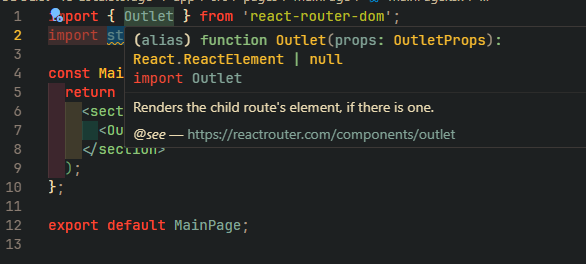
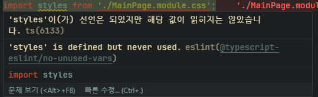
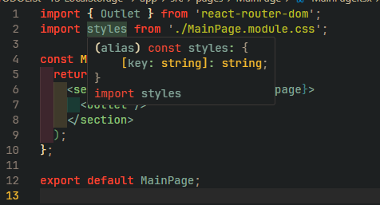

# 문제 정의

---

```tsx
import { Outlet } from 'react-router-dom';
import styles from './MainPage.module.css';

const MainPage: React.FC = () => {
  return (
    <section>
      <Outlet />
    </section>
  );
};

export default MainPage;
```

다음과 같이 `module.css` 파일을 가져오려고 하니 다음과 같은 오류가 발생한다.

```
`./MainPage.module.css` 모듈 또는 해당 형식을 가져올 수 없습니다.
```

# 원인 파악

---

만약 `module.css` 를 가져오는 부분에서 다음과 같이 사용하면 에러가 발생하지 않는다.

```tsx
import styles from './MainPage.module.css'; // 에러 발생
import './MainPage.module.css'; // 에러가 발생하지 않음
```

타입스크립트는 `module.css` 와 같은 `TS` 가 아닌 파일 형식을 모듈로 인식하지 않는다.

# 문제 해결

---

이를 해결해주기 위해선 타입스크립트가 인식 할 수 있도록 모듈 형식을 선언해주는 것으로 문제를 해결 할 수 있다.

`src` 폴더 내에 `global.d.ts` 파일을 생성해주고

해당 파일 내에 다음과 같은 타입을 선언해준다.

```tsx
declare module '*.module.css' {
  const content: { [key: string]: string };
  export = content;
}
```

이후에는 오류가 발생하지 않는다.

# 해결하며 배운점

---

### `module.css` 가 가지는 의미

---

`module.css` 파일은 `css` 파일을 하나의 자바스크립트 객체로 만들어 `import` 할 수 있게 만들어주며

자바스크립트 객체로 만들어진 `module.css` 파일은 해당 `module.css` 에 정의된 스타일들을

프로퍼티와 값의 형태로 가져온다.

```tsx
import styles from './MainPage.module.css'; // 에러 발생
```

내가 다음과 같이 `module.css` 파일을 `styles` 라는 이름으로 `import` 해오는 행위는

`module.css` 파일을 자바스크립트 객체로서 `styles` 라는 이름을 지어 가져오겠다는 것을 의미한다.

### 에러가 발생했던 이유

---



**타입스크립트에서 어떤 객체를 사용 할 때에는 항상 해당 객체에 대한 타입이 선언되어 있어야 한다.**

그래야 컴파일러가 해당 객체를 컴파일 하는 동안 타입을 확인하고 타입을 비교 할 수 있기 때문이다.



`module.css` 를 통해 자바스크립트 객체로 만든 `css` 파일은 따로 타입이 선언되어 있지 않다.

이에 타입스크립트 컴파일러는 타입이 선언되지 않은 객체의 사용을 방지하기 위해 오류를 발생 시킨다.

### `.d.ts` 가 가지는 의미

---

`.d.ts` 가 가지는 의미는 타입 스크립트 프로젝트에서 사용되는 **유형 선언 파일이다.**

해당 파일에는 **실행 가능한 코드가 포함되어 있지 않고 타입스크립트 컴파일러에 유형 정보를 제공하여 다양한 객체들의 타입을 선언해둔다.**

`.d.ts` 는 타입스크립트 컴파일러가 인식 할 수 있도록 객체들의 타입을 선언해두는 곳이다.

타입을 제공하지 않는 써드파티 라이브러리의 모듈이나 , 경험했던 `module.css` 에 대한 타입 선언

혹은 전역적으로 사용하는 객체들의 타입을 선언해둘 수 있다.

### `module.css` 의 타입을 `decalre` 해두는 코드가 가지는 의미들

---

```tsx
declare module '*.module.css' {
  const content: { [key: string]: string };
  export = content;
}
```

나는 `global.d.ts` 내에서 `module.css` 에 대한 타입을 다음처럼 선언했다.

해당 선언 방식이 갖는 의미를 살펴보자

`declare module '*.module.css'` 부분은 다음과 같다.

`.module.css` 로 끝나는 모든 (`*`) 파일들에 대해서 `module` 로 인식하겠다는 것을 의미한다.

이를 통해 우리는 `*.module.css` 로 끝나는 파일들을 모두 모듈로 인식 하여 `import` 가 가능하게 한다.

`{}` 내부에서 `const content : ` 는 `content` 라는 타입 객체를 선언한다.

`module.css` 로 만들어지는 자바스크립트 객체는 `{ key : value}` 값으로 생긴 객체이기 때문에

인덱스 시그니처를 이용하여 `{[key : string] : string}` 형태로 선언해준다.

`export = content` 부분은 해당 타입 객체를 `CommonJS` 모듈로 내보내 타입스크립트 코드에서 사용 할 수 있도록 한다.

예를 들어 다음과 같이 말이다.

```tsx
const buttonClass = styles.button;
```

즉 정리하자면 다음과 같다.

```tsx
declare module '*.module.css' {
  // module.css 로 끝나는 모든 파일을 module 로 인식
  const content: { [key: string]: string }; // 해당 모듈파일의 타입 객체 생성
  export = content; // 해당 타입 객체를 전역에 export
}
```



해당 파일을 선언 한 후 `styles` 객체에 타입이 올바르게 선언된 모습을 볼 수 있다.
